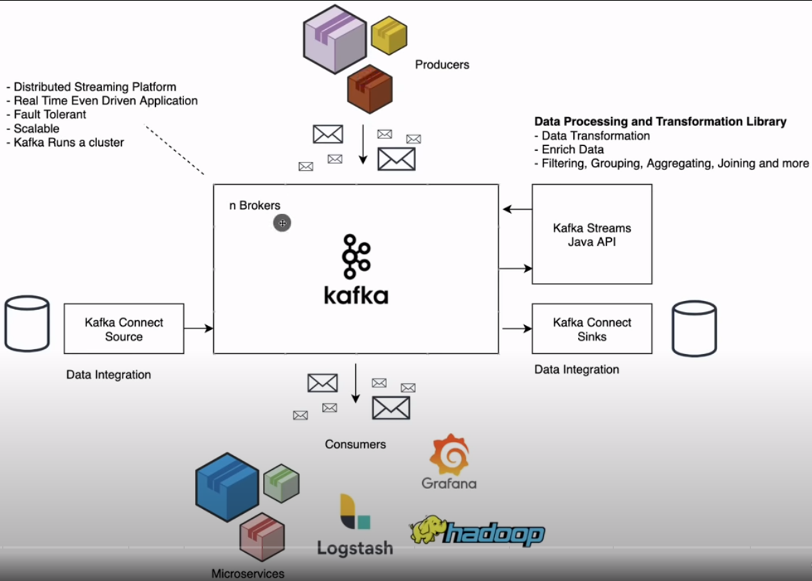
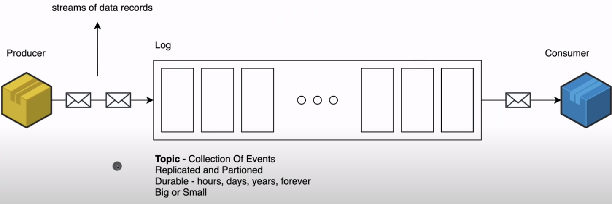
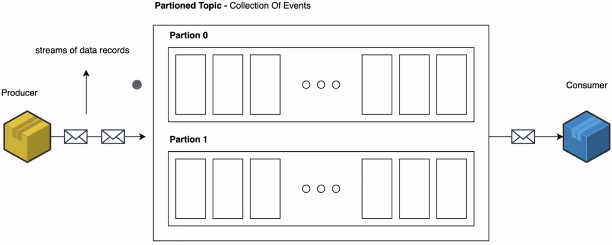
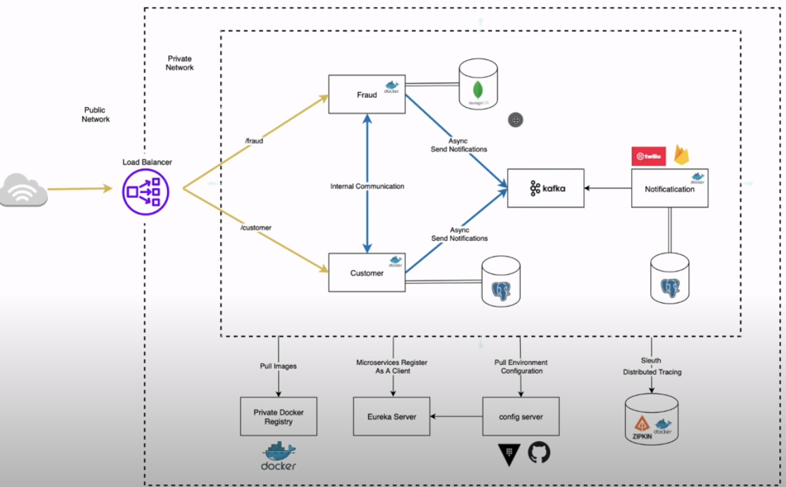
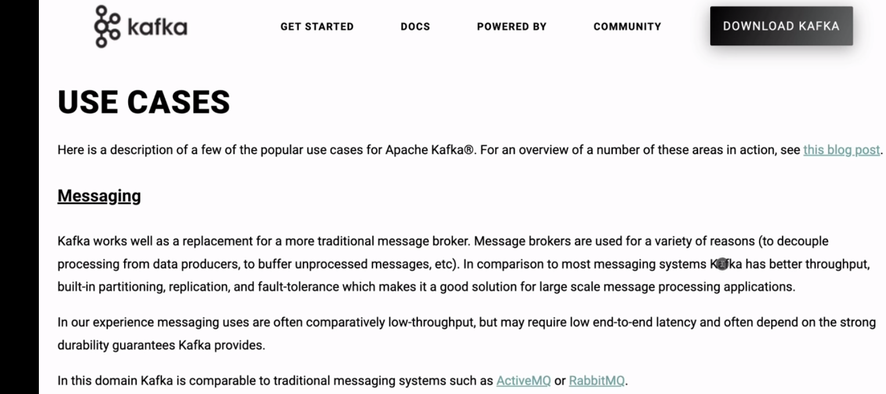
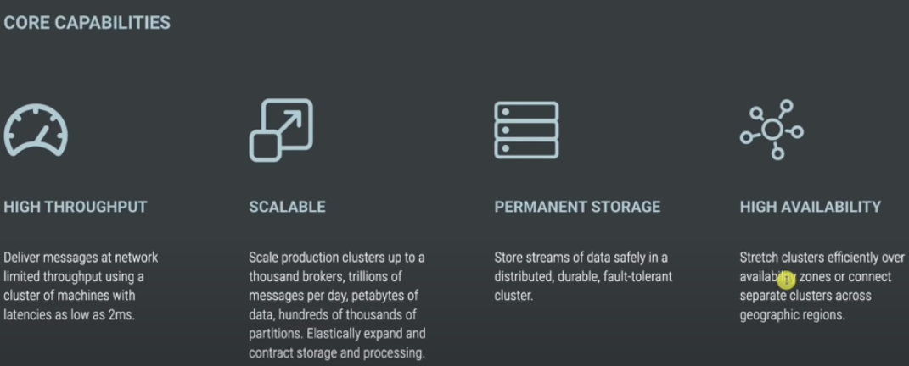

# Kafka Tutorial - Spring Boot Microservices

Based on <https://www.youtube.com/watch?v=SqVfCyfCJqw>

**Overview**



**Topics**




**Architecture**



**Use Case**



**Capabilities**

<http://kafka.apache.org>



<https://habr.com/en/post/529222/>
<https://docs.confluent.io/platform/current/app-development/kafkacat-usage.html>

```bash
# in $HOME/kafka-docker
podman-compose -f docker-compose-kafka-single-broker.yml up


kafkacat -b localhost:9092 -X security.protocol=sasl_plaintext -X sasl.mechanisms=PLAIN -X sasl.username=admin -X sasl.password=admin-secret -L

//to read from topic
kafkacat -b localhost:9092 -t amigoscode -X security.protocol=sasl_plaintext -X sasl.mechanisms=PLAIN -X sasl.username=admin  -X sasl.password=admin-secret

//  to consume from topic
kafkacat -b localhost:9092 -t amigoscode -C -c1 -X security.protocol=sasl_plaintext -X sasl.mechanisms=PLAIN -X sasl.username=admin  -X sasl.password=admin-secret


curl --location --request POST 'localhost:8080/api/v1/messages' \
--header 'Content-Type: application/json' \
--data-raw '{
    "message": "Api with Kafka"
}'
```